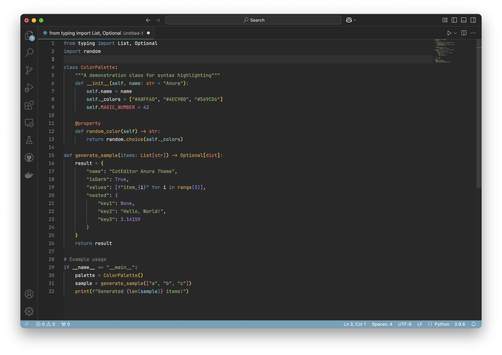

# CotEditor Anura Theme for VS Code

A Visual Studio Code port of CotEditor's Anura theme, bringing its clean dark aesthetics and carefully selected color palette to VS Code.

## Features

- Dark theme optimized for readability
- Consistent UI elements styling
- Green cursor matching CotEditor for better visibility

## Installation

1. Open Visual Studio Code
2. Press `Ctrl+P` / `Cmd+P` to open the Quick Open dialog
3. Type `ext install ivezakis.anura-theme`
4. Press Enter

## Activation

1. Open VS Code Command Palette (`Ctrl+Shift+P` / `Cmd+Shift+P`)
2. Type `Color Theme`
3. Select `CotEditor Anura`

## Credits

This theme is a port of the Anura theme from CotEditor. Original theme design credits go to CotEditor.

## Contributing

If you find any issues or have suggestions for improvements, please feel free to:

1. [Open an issue](https://github.com/ivezakis/anura-theme/issues)
2. Submit a pull request

**Enjoy!**
